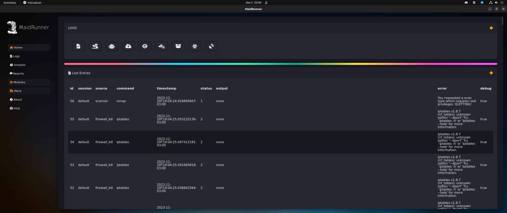

# Maid Runner

Maid Runner is a versatile task automation software designed to serve
as the foundation for various cyber security modules. It provides
capabilities for tasks such as forensic research, OSINT (Open Source 
Intelligence),scanning, backup and copying, intrusion testing of 
applications and APIs, and more.


## MaidVisual



Since October 13, 2023, the MaidRunner project has extended its support to
native Linux applications for statistical analysis, log management,
and data visualization. This user interface (UI) is NOT designed to
replace the command-line interface (CLI). It currently relies on certain 
components of the CLI, including elements of the Maid_Build build system 
and Maid_Lists, which depends on the **/var/maid_lists/report/archive.db**
for its operation.

## MaidRunner

<center>
    <b>
        🚨 Important Notice: Use maid_runner our maid_runner --help instead MANPAGE
    </b>
</center>

For detailed information on how to use Maid Runner and explore its features, 
please refer to the new **MANPAGE.md** file in the project repository.

### Instalation

The project initially includes a set of default files. These files
are created using the best possible data analysis techniques, and
their final versions are merged into the main project.

It consists of three main components: 

* maid_runner for application logic.
* maid_visual for data visualization 
* maid_api for hosting a local API with data generated by the maid_runner application.

### Build Instructions

To build the project, follow these instructions:

**Step 1: Clone the Repository**

```bash

git clone https://github.com/th3Maid/MaidRunner.git
cd MaidRunner

```

**Step 2: Run the Build Script**

Execute the provided build script build.sh:

```bash
chmod +x build.sh
./build.sh

```

The script will prompt you to enter the root password, create a folder called release, and place the built executables inside it.
Step 3: Explore the Release Folder

Navigate to the release folder to find the built components:

* **maid_runner**: The Maid application executable.
* **maid_visual**: Executable for data visualization.
* **maid_api**: Local API server hosting data created by maid_runner.

**Usage**

After building the project, you can run each component individually. Here's a brief overview:

**Running Maid Runner**

Execute the following command to run the Maid Runner application:

```bash

./release/maid_runner

```

**Running Maid Visual**

To visualize data, run the Maid Visual application:

```bash
./release/maid_visual
```

**Running Maid API**

Start the local API server with the following command:

```bash
./release/maid_api
```

The Maid API will serve data created by the Maid Runner application.
Contribution

Feel free to contribute to Maid Runner by submitting issues or pull requests. Your input is valuable!

### License

<center>
**This project is licensed under the GNU General Public License
v3.0.**</center>
