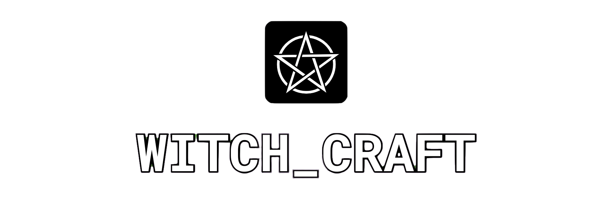

<center>
<br>
<h1>WITCH_CRAFT</h1>
<br>
</center>


<center>

        🚧 warning: For detailed information about how to use witch_craft 
        run witch_craft h or witch_craft --help.

</center>
<hr>

### Instalation

The project initially includes a set of default files. These files
are created using the best possible data analysis techniques, and
their final versions are merged into the main project.

It consists of two main components: 

* **witch_craft** for CLI application.
* **witch_oracle** for GUI application 

### Build Instructions

To build the project, follow these instructions:

**Step 1: Clone the Repository**

```bash
git clone https://github.com/th3Maid/witch_craft.git
cd witch_craft
```

**Step 2: Run the Build Script**

Execute the provided build script build.sh:

```bash
chmod +x build.sh
./build.sh
```

The script will prompt you to enter the root password, create a folder called release, and place the built executables inside it.
Step 3: Explore the Release Folder

Navigate to the release folder to find the built components:

* **witch_craft**: The cli application executable.
* **witch_oracle**: The gui application executable.

**Usage**

After building the project, you can run each component individually. Here's a brief overview:

**Running Witch_Craft**

Execute the following command to run the witch_craft application:

```bash

./release/witch_craft

```

**Running Witch Oracle**

To visualize data, run the Witch Oracle application:

```bash
./release/witch_oracle
```

Feel free to contribute to witch_craft by submitting issues or pull requests. Your input is valuable!

### License

<center>
<b>
This project is licensed under the GNU General Public License
v3.0.
</b>
</center>
